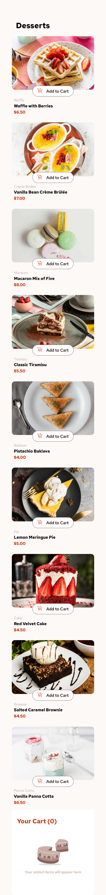

# Frontend Mentor - Product list with cart solution

This is a solution to the [Product list with cart challenge on Frontend Mentor](https://www.frontendmentor.io/challenges/product-list-with-cart-5MmqLVAp_d). Frontend Mentor challenges help you improve your coding skills by building realistic projects.

## Table of contents

- [Overview](#overview)
  - [The challenge](#the-challenge)
  - [Screenshot](#screenshot)
  - [Links](#links)
- [My process](#my-process)
  - [Built with](#built-with)
  - [What I learned](#what-i-learned)
- [Author](#author)

## Overview

### The challenge

Users should be able to:

- Add items to the cart and remove them
- Increase/decrease the number of items in the cart
- See an order confirmation modal when they click "Confirm Order"
- Reset their selections when they click "Start New Order"
- View the optimal layout for the interface depending on their device's screen size
- See hover and focus states for all interactive elements on the page

### Screenshot





### Links

- Solution URL: [Product List With Cart Github](https://github.com/abdul-haseeb123/product-list-cart-next)
- Live Site URL: [View Project](https://abdul-haseeb123.github.io/product-list-cart-next/)

## My process

### Built with

- Semantic HTML5 markup
- Flexbox
- CSS Grid
- Mobile-first workflow
- [React](https://reactjs.org/) - JS library
- [Next.js](https://nextjs.org/) - React framework
- [Tailwind CSS](https://tailwindcss.com/) - For styles

### What I learned

I learned how to use Context API in React and Next JS to manage the state of the application.

```js
// src/context/ProductsContext.tsx
"use client";

import React, { useState, useContext, useEffect, createContext } from "react";
// ... other imports

const ProductsContext = createContext<{
  products: Product[];
  incrementDecrementProduct: (productName: string, increment: boolean) => void;
  removeProductFromCart: (productName: string) => void;
  resetProducts: () => void;
}>({
  products: [],
  incrementDecrementProduct: () => {},
  removeProductFromCart: () => {},
  resetProducts: () => {},
});

const useProducts = () => useContext(ProductsContext);

const ProductsProvider: React.FC<{ children: React.ReactNode }> = ({
  children,
}) => {
  const [products, setProducts] = useState<Product[]>([]);

  const incrementDecrementProduct = (
    productName: string,
    increment: boolean
  ) => {
    // logic to increment or decrement product count
  };

  const resetProducts = () => {
    // logic to reset products to it's initial state
  };

  const removeProductFromCart = (productName: string) => {
    // logic to remove product from cart
  };

  useEffect(() => {
    // fetch products from data.json
  }, []);
  return (
    <ProductsContext.Provider
      value={{
        products,
        incrementDecrementProduct,
        removeProductFromCart,
        resetProducts,
      }}
    >
      {children}
    </ProductsContext.Provider>
  );
};

export { useProducts, ProductsProvider };
```

I also learned how to create Modals in Next JS and React using `dialog` element

## Author

- Frontend Mentor - [@abdul-haseeb123](https://www.frontendmentor.io/profile/abdul-haseeb123)
- LinkedIn - [@ashaseeb](https://www.linkedin.com/in/ashaseeb/)
